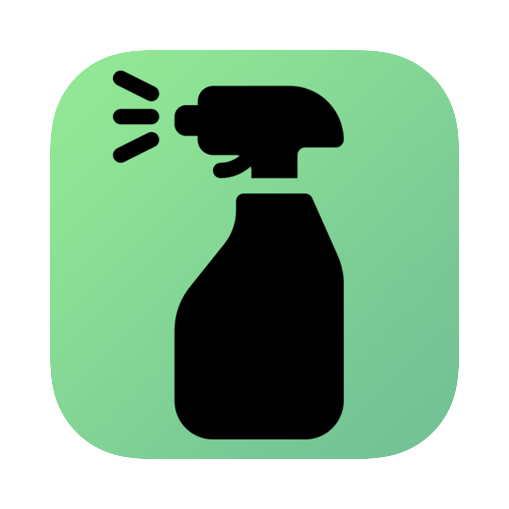

# Polish

[](https://opensource.org/licenses/MIT)


<p align="center" width="100%">
    
</p>

Polish is a lightweight yet powerful macOS application designed to help you reclaim disk space by cleaning up junk files, temporary caches, and orphaned application data that accumulates over time.

## ✨ Features

- **Homebrew Cleanup**: Automatically runs `brew cleanup` and `brew autoremove` to clean up old versions of packages and remove unused dependencies
- **Cache Cleaning**: Identifies and removes unnecessary cache files from common system locations
- **Orphaned App Data**: Detects and lists potential leftover files from uninstalled applications
- **User-Friendly Interface**: Simple, clean UI that makes system maintenance accessible to everyone
- **Real-Time Progress**: See the cleaning process as it happens with detailed output

## 🚀 Getting Started

### Requirements

- macOS 11.0 or later
- Xcode 13+ (for building from source)

### Installation

#### Option 1: Download the App

1. The first release is not out yet. Stay tuned!

#### Option 2: Build from Source

```bash
git clone https://github.com/ADJB1212/Polish.git
cd Polish
xcodebuild -project Polish.xcodeproj -scheme Polish -configuration Release
```

## 🛠️ Usage

1. Launch the application
2. Click "Run Brew Cleanup" to clean up Homebrew packages
3. Click "Find Files" to scan your system for unnecessary files
4. Review the output in the scrollable text area
5. (Future feature) Select files to remove and click "Clean"
